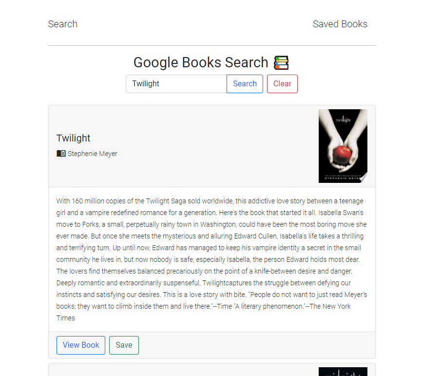
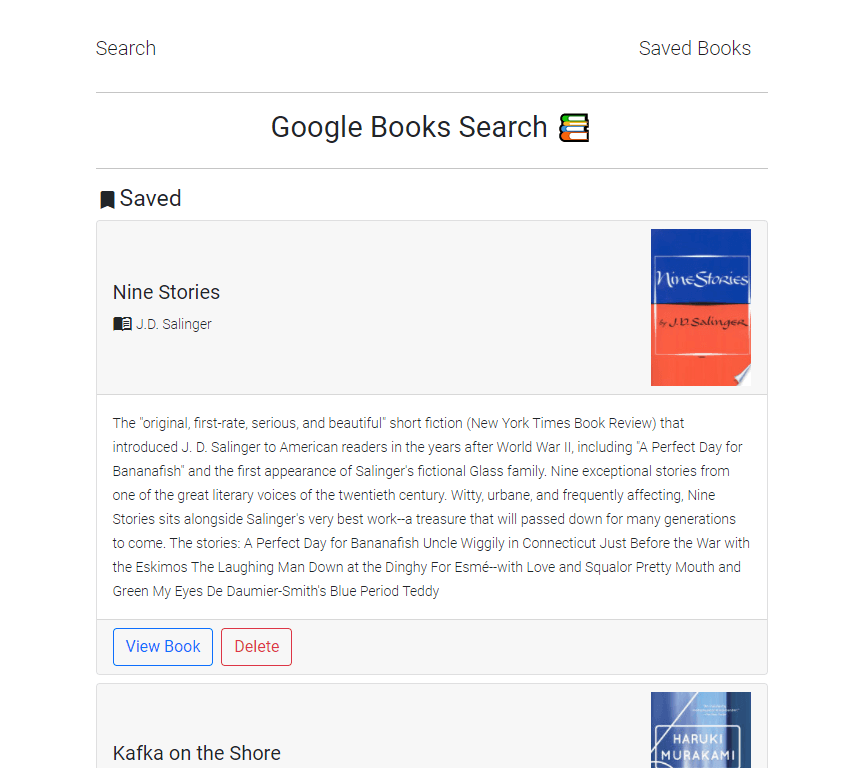

# React Book Search 📚

#### 📍 [View Deployment on Heroku](https://katsign-book-search.herokuapp.com/) 📍

### Search, save and remove saved books from a reading list.

## *Table of Contents*

- [Description](#description)
- [Installation](#installation)
- [Usage](#usage)
- [Screenshots](#screenshots)
- [Contact](#contact)

## *Description*

This application uses the MERN stack to allow a user to search for books from the Google Books API and curate a reading list.

## *Installation*

### Local Clone

#### Navigate into the repository folder on your local machine and open the built-in terminal. You will need Node.js installed and MongoDB running to use this application.

- On the command line, type `npm install` to pull the app's dependencies to your local.
- Type `npm start` to run the application locally.
- Navigate to `http://localhost:3000` to view the development server.

## *Usage*

- The initial state of the page shows `No Results to Display`.
- Use the inline form to enter a query and scroll through the results.
- To view a book's extended synopsis page on Google Books, click `View Book`.
- When a title sparks interest, click `Save` to add it to the database.
- Use the `Saved Books` link at the top right of the page to view the Saved titles in the database.
- Click `Delete` to remove books from the Saved list.
- Use the `Back to Top` footer link to return to the top menu.

## *Screenshots*

Search View  |  Saved Books View
:-------------------------:|:-------------------------:
  |  

## *Contact*

🔗 Links in Bio @[katsign](https://github.com/katsign)

---
This project is MIT licensed. &copy; 2021
